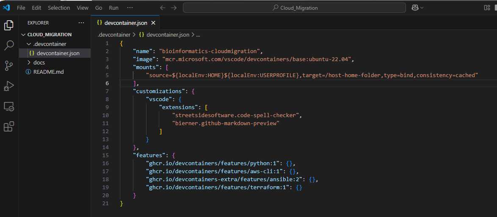
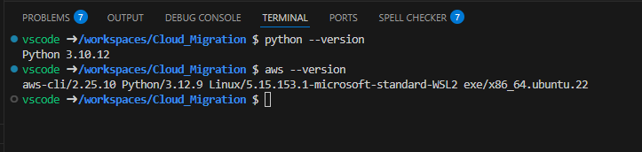

# Using Visual Studio Dev Containers


[Visual Studio Dev Containers](https://code.visualstudio.com/docs/devcontainers/containers) offer a streamlined, consistent, and reproducible development environment by encapsulating all project dependencies and tools within a container, ensuring that developers can work on projects with minimal setup and configuration issues.

The Visual Studio Dev Containers tutorial specifies Docker as the container tool on your local machine.  Docker Desktop is not free for commercial or government organizations.   [Podman](https://podman.io/) is a free and opensource container tools on your local environment. Podman also has the security advantage of running on windows without requiring administrative priviledges.

This guide walks through the steps to use Visual Studio Dev Containers with Podman on a Windows 11 machine.  

## Prerequisites

1. Administrator rights on your laptop

2. [Visual Studio Code](https://code.visualstudio.com/) installed.

3. Windows Subsystem for Linux(WSL) Installed

    1. Determine if WSL is already installed and running
        ```
        >wsl --version
        WSL version: 2.2.4.0
        Kernel version: 5.15.153.1-2
        WSLg version: 1.0.61
        MSRDC version: 1.2.5326
        Direct3D version: 1.611.1-81528511
        DXCore version: 10.0.26091.1-240325-1447.ge-release
        Windows version: 10.0.22621.4890
        ```

    2. If it is not installed open a command window and type
        ```
        >wsl --install
        ```

## Step 1. Install Podman

1. Download and install [Podman](https://podman-desktop.io/)

2. Initialize Podman 
    
    You only need to do this once
    ```
    >podman machine init 
    ```
3. Start Podman
    ```
    >podman machine start
    Starting machine "podman-machine-default"

    This machine is currently configured in rootless mode. If your containers
    require root permissions (e.g. ports < 1024), or if you run into compatibility
    issues with non-podman clients, you can switch using the following command:

        podman machine set --rootful

    API forwarding listening on: npipe:////./pipe/docker_engine

    Docker API clients default to this address. You do not need to set DOCKER_HOST.
    Machine "podman-machine-default" started successfully
    ```

## Step 2. Test Podman Install

1. Download and run a container image from the RedHat registry

    This step will connect to the RedHat registry.  
    - Note: This will fail if you have a VPN or other network security restrictions that prevent access to the RedHat registry.  Disconnect from VPN to pull down images from the registry.
    
    ```
    >podman run ubi8-micro date
    Resolved "ubi8-micro" as an alias (/etc/containers/registries.conf.d/000-shortnames.conf)
    Trying to pull registry.access.redhat.com/ubi8-micro:latest...
    Getting image source signatures
    Checking if image destination supports signatures
    Copying blob sha256:3968a64314ecc20edd87d99ec65c7ece493f200aa996ea3abf3e5c60a6fcedbd
    Copying config sha256:d6ee2a517c2218f0d3e9aa405ecc97be6cee781db2acfac3ed5c13f051ba6a9d
    Writing manifest to image destination
    Storing signatures
    Mon Mar 31 23:56:15 UTC 2025
    ```

If the command is successful you will see the date as the last item in your console output.


## Step 3. Configure Visual Studio Code to use Podman instead of Docker

1. Open Visual Studio Code

2. Modify VSCode to use Podman for containers.

    In VSCode Go to File->Preferences->Settings and search for `docker`.  The default settings use docker. 

    

    Change these for Podman:

    


## Step 4. Test a Development Container

1. Open Visual Studio Code 

2. Clone the test repository `https://github.com/TX-DSHS/Cloud_Migration` to a local directory

3. Open the `devcontainer.json` file

    

   This files show the Dev Container will run Ubuntu 22.04.  It will have add two Visual Studio extensions.  More importantly it will includes python, the AWS CLI, Ansible and Terraform as features. These will be installed on the Ubuntu 22.04 operating system.

   This means that anyone who starts the dev container will have python, the AWS CLI, Ansible and Terraform already installed on Ubuntu.
   
   
4. Start the Dev Container

   Open the command bar by typing Ctrl-Shift-P and search for Dev Containers.  Select `Dev Containers: Rebuild and Reopen in Container`.  
   
   A container build will start.  

   

   The first time this is run it will take a while as it is downloading everything to create your container.

5. Open a terminal window for Ubuntu 22.04

   When it finished you will be able to see the files in Explorer.

   

   Open a Terminal windows

   

   Verify that Python and AWS are installed.

   


## (Optional)  Step 5 Add or remove Dev Containers features

1. Add or remove features in Visual Studio code

    Open the command by typing Ctrl-Shift-P and search for Dev Containers.  If you click `Dev Containers: Configure Container Features` container features you can add or remove features

    

    Follow the prompts and select from the list of features.

    
## References

How to run Podman on Windows
https://github.com/containers/podman/blob/main/docs/tutorials/podman-for-windows.md

Here is how to modify the docker path
https://code.visualstudio.com/remote/advancedcontainers/docker-options