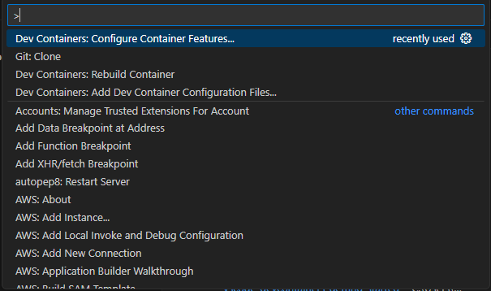

# Getting Started with Visual Studio Dev Containers


[Visual Studio Dev Containers](https://code.visualstudio.com/docs/devcontainers/containers) offer a streamlined, consistent, and reproducible development environment by encapsulating all project dependencies and tools within a container, ensuring that developers can work on projects with minimal setup and configuration issues.

Why use VS Code Dev Containers?
- Standard development environments
- Ease of onboarding new team members
- Simplified setup for various projects
- Isolation of your development environment from your local machine

The Visual Studio Dev Containers tutorial specifies Docker as the container tool on your local machine.  Docker Desktop is not free for commercial or government organizations.   

[Podman](https://podman.io/) is a free and opensource container tools on your local environment. Podman also has the security advantage of running on windows without requiring administrative priviledges.

These are the steps to use Visual Studio Dev Containers with Podman on Windows 11  

## Prerequisites

1. Administrator rights on your laptop

2. [Visual Studio Code](https://code.visualstudio.com/) installed.

3. Windows Subsystem for Linux(WSL) Installed

    1. Determine if WSL is already installed and running
        ```
        >wsl --version
        WSL version: 2.2.4.0
        Kernel version: 5.15.153.1-2
        WSLg version: 1.0.61
        MSRDC version: 1.2.5326
        Direct3D version: 1.611.1-81528511
        DXCore version: 10.0.26091.1-240325-1447.ge-release
        Windows version: 10.0.22621.4890
        ```

    2. If it is not installed open a command window and type
        ```
        >wsl --install
        ```

## Step 1: Install Podman

1. Download and install [Podman Desktop](https://podman-desktop.io/)
    - Note: The steps below use the command line to intialize and start podman. You can do these [same steps using Podman Desktop](https://podman-desktop.io/docs/installation/windows-install).

2. Initialize Podman 
    
    You only need to do this once
    ```
    >podman machine init 
    ```
3. Start Podman
    ```
    >podman machine start
    Starting machine "podman-machine-default"

    This machine is currently configured in rootless mode. If your containers
    require root permissions (e.g. ports < 1024), or if you run into compatibility
    issues with non-podman clients, you can switch using the following command:

        podman machine set --rootful

    API forwarding listening on: npipe:////./pipe/docker_engine

    Docker API clients default to this address. You do not need to set DOCKER_HOST.
    Machine "podman-machine-default" started successfully
    ```

## Step 2: Test Podman Install

1. Download and run a container image from the RedHat registry

    This step will connect to the RedHat registry.  
    - Note: This will fail if you have a VPN or other network restrictions that prevent access to the RedHat registry.  Disconnect from VPN to pull down images from the registry.
    
    ```
    >podman run ubi8-micro date
    Resolved "ubi8-micro" as an alias (/etc/containers/registries.conf.d/000-shortnames.conf)
    Trying to pull registry.access.redhat.com/ubi8-micro:latest...
    Getting image source signatures
    Checking if image destination supports signatures
    Copying blob sha256:3968a64314ecc20edd87d99ec65c7ece493f200aa996ea3abf3e5c60a6fcedbd
    Copying config sha256:d6ee2a517c2218f0d3e9aa405ecc97be6cee781db2acfac3ed5c13f051ba6a9d
    Writing manifest to image destination
    Storing signatures
    Mon Mar 31 23:56:15 UTC 2025
    ```

If the command is successful you will see the date as the last item in your console output.  This verifies Podman can run a container successfully.


## Step 3: Configure Visual Studio Code to use Podman instead of Docker

1. Open Visual Studio Code

2. Modify VSCode to use Podman for containers.

    In VSCode Go to File->Preferences->Settings and search for `docker`.  The default settings use docker. 

    

    Change these for Podman:

    


## Step 4:  Build you Development Container

1. Open Visual Studio Code 

2. Clone this repository `https://github.com/scottmillers/vscode-devcontainer-example` to a local directory

3. Open the  `.devcontainer/devcontainer.json`

   ```
   {
    "name": "vscode-devcontainer-example",
    "image": "mcr.microsoft.com/vscode/devcontainers/base:ubuntu-22.04",
    "mounts": [
        "source=${localEnv:HOME}${localEnv:USERPROFILE},target=/host-home-folder,type=bind,consistency=cached"
    ],
    "customizations": {
        "vscode": {
            "extensions": [
                "streetsidesoftware.code-spell-checker",
                "bierner.github-markdown-preview"
            ]
        }
    },
    "features": {
        "ghcr.io/devcontainers/features/python:1": {},
        "ghcr.io/devcontainers/features/aws-cli:1": {},
        "ghcr.io/devcontainers-extra/features/ansible:2": {},
        "ghcr.io/devcontainers/features/terraform:1": {}
    }
   }
   ```

   This is the Dev Container configuration file. 
   - It will use a base ubuntu-22.04 as the container image 
   - It will mount your home directory to a directory in Ubuntu called `host-home-folder`  
   - It will add two extension to Visual Studio code that only added when you open the container
   - It will add python, the AWS CLI, Ansible and Terraform to the Ubuntu 22.04 base image

  
   
   
4. Start the Dev Container

   Open the command bar by typing Ctrl-Shift-P and search for Dev Containers.  Select `Dev Containers: Rebuild and Reopen in Container`.  
   
   The container build will start.  

   

   The first time this is run it will take a while as it is downloading everything to create your container.  Wait for it to finish building.

   When it finished you will be able to see the files in VsCode Explorer. Noice that the explorer adds the name of the Dev Container to the root 

    

5. Open a terminal window for Ubuntu 22.04

   

6.  Verify that Python and AWS are installed.

   
    

7. Run the Python code

    

8. Verify you can see your home folder content within the container

    The Dev Container mounts the home folder.  This allows you to access your host operating system files from within the container.
    

    

## (Optional)  Step 5: Add or remove Dev Containers features

1. Add or remove features in Visual Studio code

    Open the command by typing Ctrl-Shift-P and search for Dev Containers.  If you click `Dev Containers: Configure Container Features` container features you can add or remove features

    

    Follow the prompts and select from the list of features.

    

    Once you have selected your features the Dev Container will be rebuild.

## (Optional)  Step 6: Cloning your repository into WSL or a Dev Volume  

You can [improve the disk performance](https://code.visualstudio.com/remote/advancedcontainers/improve-performance) by either storing your source in the WSL 2 filesystem or cloning your repository in a container volume.  

